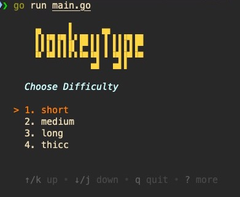

# 🧠 DonkeyType

DonkeyType is a terminal-based typing game written in Go using [Bubble Tea](https://github.com/charmbracelet/bubbletea) and [Lip Gloss](https://github.com/charmbracelet/lipgloss).  
It's minimal, retro-styled, and focused on improving your typing speed.



---

## 🚀 Features

- ⌨️ Practice typing real words
- 🎯 Choose difficulty levels: `short`, `medium`, `long`, `thicc`
- 🧾 Real-time correctness feedback
- 📊 End screen showing:
  - Time taken
  - WPM (Words Per Minute)
  - Mistakes

---

## 📦 Built With

- [Go](https://golang.org/)
- [Bubble Tea](https://github.com/charmbracelet/bubbletea) — for TUI
- [Lip Gloss](https://github.com/charmbracelet/lipgloss) — for styling
- [Bubbles](https://github.com/charmbracelet/bubbles) — for reusable components

---

## 🛠️ Installation

```bash
git clone https://github.com/your-username/donkeytype.git
cd donkeytype
go run main.go
```
